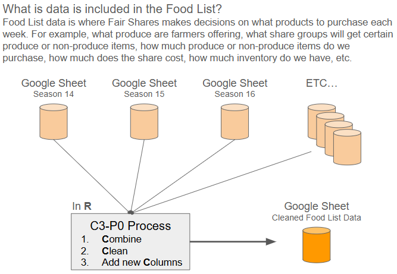

# Food_List_Combined_Clean
The Food List (Google Sheet document) is the main hub for Fair Shares decision making. Currently we archive separate years of Fair Shares Food List data into separate Google Sheet documents. This repo was created to create a clean data source that combines multiple archived seasons into one source file. This will allow for: 
1. Enterprice process for cleaning, combining, and enhancing an important company data set.
2. Streamlined process for creating dashboards off of this key company database.

The process of cleaning this data set has been dubbed C3-P0, due to the three C's that take place in the R processing of this data. 

## Requirements
1. Create easily runnable code to pull in each week's new archive data
2. Combine all seasonal files into one source file (overwritten every time via this code)
3. Must add in a new column season column in the output file
4. Clean up any missing records or columns that have missing values (where applicable)
5. Add in additonal cleansed columns (where applicable)
6. Creat a single source of truth so future projects do not have to find multiple seasonal files and contain extra work to clean data

* [Clean Combined Google Sheet](https://docs.google.com/spreadsheets/d/1xs8TAMrSsJuL_gou4y0DBH3IkaTH0eBn_pdboCGWFTI/edit#gid=0)
* [Season 14 Google Sheet](https://docs.google.com/spreadsheets/d/1m45w0hQOkvUFvNpc5MwQcN4snGs0Lkrb6kJfOUJf6tw/edit)
* [Season 15 Google Sheet](https://docs.google.com/spreadsheets/d/125T2Gz-LJ9hyVivRasRD-Uzm-avJIbJfKN2ACqNrHM0/edit)
* [Season 16 Google Sheet](https://docs.google.com/spreadsheets/d/1Jo2p-q4CBucAhYu3SWaCxjtLLAM26F8-RGcczwvOhqk/edit)
* [Season 17 Google Sheet](https://docs.google.com/spreadsheets/d/1IrKLakl0wpqE0maXv2PGvN8KZTbzWv0cr3dDsLereE4/edit)
* [Season 18 Google Sheet](https://docs.google.com/spreadsheets/d/1XpLuuzsK36o1jOqYsPBC8DFlu3c0PrJAGtbYprajETU/edit)
